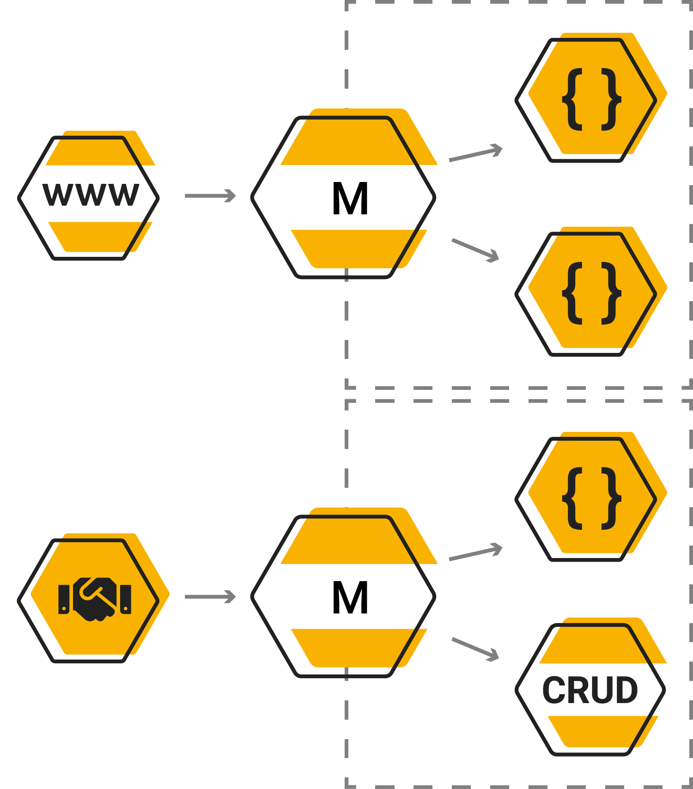
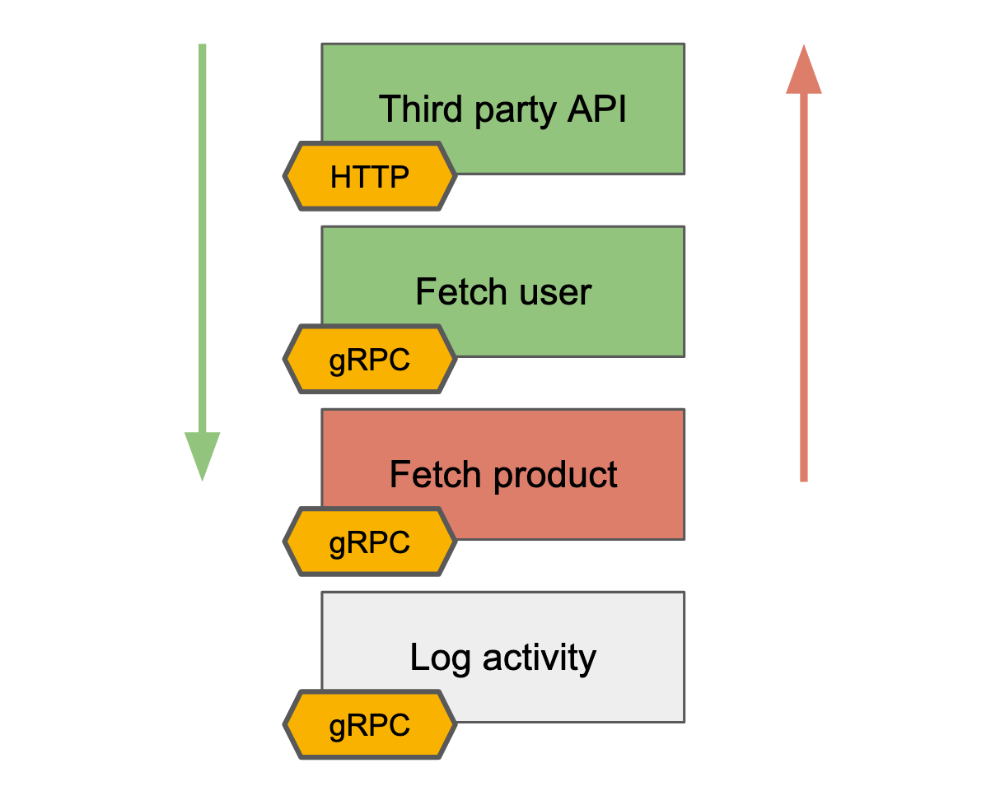
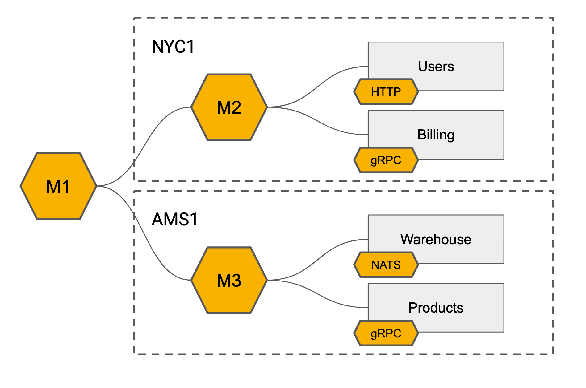

# Cookbook
Various examples are available inside the Github repository. Or checkout the chapters available inside the getting started for more detailed documentation.

## Flows
The flows are configured using one or more HCL files. These HCL files define what calls have to perform on execution or rollbacks to be called during a unexpected error.



A flow contains a collection of resources which is executed when a endpoint gets triggered. If an error occurs during the execution of the flow are all rollbacks of executed calls called.

```flow
flow "todo" {
    resource "query" {
        request "service" "GetTodos" {}
    }
}
```

::: tip
Services are defined inside the schema definitions
:::

You could expose flows by defining an endpoint. An endpoint defines the protocol to be used and protocol-specific options.

```flow
endpoint "todo" "http" {
    method = "GET"
    endpoint = "/todos"
}
```

## Resources

### Requests and rollbacks
A resource inside a flow could contain a request and/or a rollback. Requests are called when a flow is triggered. If any of the defined resources returns an unexpected error the rollbacks of all executed resources executed. Errors returned by rollbacks are ignored.

```flow
resource "create" {
    request "service" "CreateUser" {
        username = "{{ input:username }}"
    }

    rollback "service" "DeleteUser" {
        id = "{{ create:id }}"
    }
}
```


### Headers
Headers contain keys and values which define constants or references. Headers are passed to the called and send to the service. Headers could be defined in both requests and rollbacks.

```flow
input "schema.Object" {
    header = ["Authorization"]
}

resource "create" {
    request "service" "Authenticate" {
        header {
            Authorization = "{{ input.header:Authorization }}"
        }
    }
}
```

::: tip
When referencing header properties inside other resources remember that they have to be defined.
:::

### Flow resource branches
Nodes (resources) are executed concurrently from one another. When a node is executed a check is performed to check whether the dependencies have been met. Only if all of the dependencies have been met is the node executed.

```bash
+------------+
|            |
|    Node    +------------+
|            |            |
+------+-----+            |
       |                  |
       |                  |
+------v-----+     +------v-----+
|            |     |            |
|    Node    |     |    Node    |
|            |     |            |
+------+-----+     +------+-----+
       |                  |
       |                  |
+------v-----+            |
|            |            |
|    Node    <------------+
|            |
+------------+
```

### References
References are defined inside a template definition. References contain two parts. The resource to be targeted and the path within the given resource.

```js
{{ input:message }}
```

::: tip
A error is returned if the given resource/path has not been found or when types mismatch
:::

### Resources
Calls, inputs and outputs are resources inside a flow. All resources could be referenced. Below is a simple flow with the following resources available: input and user.

```flow
flow "fetch" {
	input "schema.Query" {}
	
	resource "user" {}
	
	output "schema.Result" {
		message = "{{ input:message }}"
	}
}
```

### Properties
Inside a resource are properties available. The available properties inside a resource might differ. Below are the available properties within different resource types. The request property is always used as default if no property is defined.

```js
{{ call.request:prop }}
```

```flow
flow "fetch" {
	input "schema.Query" {}
	
	resource "schema" {
		request "schema.User" "GetUser" {
			message = "{{ input:message }}"
		}
	}
	
	output "schema.Result" {
		message = "{{ user.request:message }}"
	}
}
```

### Path
Properties and nested properties are simply defined through the reference path.

```flow
flow "create" {
	input "schema.CreateUser" {}

	resource "user" {
		request "schema.User" "New" {
			message "address" {
				street = "{{ input:street }}"
			}
		}
	}
	
	output "schema.User" {
		message "address" {
			street = "{{ user.request:address.street }}"
		}
	}
}
```
### Message reference
Complete messages could be referenced if the content is mappable with the target property. This could be useful to reference complete objects without having to define a object over and over again.
Inside the example below is the address message copied to the output.

``` flow
flow "create" {
	input "schema.CreateUser" {}

	resource "user" {
		request "proto.User" "New" {
			message "address" {
				street = "{{ input:street }}"
			}
		}
	}
	
	output "schema.User" {
		address = "{{ user.request:address }}"
	}
}

### Self reference
Sometimes you want to copy the entire message of a given resource. This is similar to message references but could be applied to entire resources instead of properties.
Inside the example below is the user request message copied to the output inside the user property.

```flow
flow "create" {
	input "schema.CreateUser" {}

	resource "user" {
		request "schema.User" "New" {
			message "address" {
				street = "{{ input:street }}"
			}
		}
	}
	
	output "schema.UserDetails" {
		user = "{{ user.request:. }}"
	}
}
```

### Nested values
Nested values (messages) store properties, nested values could be created inside nested values.

```flow
message "nested" {
    value = "{{ input:message }}"
}
```

### Repeated values
Repeated messages accept two labels the first one is its property name and the second one is the resource reference. If a repeated message is kept empty the whole message is attempted to be copied.

```flow
repeated "destination" "input:destination" {
    country = "{{ input:destination.country }}"
}
```
::: warning
Currently are only repeated messages supported, repeated values are planned for in the future
:::

### Header values
Headers could be defined and passed similar to message properties. Header values are accessed through the `header` resource property.

```flow
input "schema.Object" {
    header = ["Authorization"]
}

resource "authenticate" {
    request "service" "Auth" {
        header {
            Authorization = "{{ input.header:Authorization }}"
        }
    }
}
```

## Error handling
Custom error objects and messages will be returned to the used in case of a unexpected failure. Global error objects could be defined which could be overridden inside flows or resources.

```flow
error "proto.Error" {
	message = "{{ error:message }}"
	status = "{{ error:status }}"
}

flow "GlobalHandleError" {
	input "proto.Empty" {}

	resource "query" {
		request "proto.Service" "ThrowError" {
		}

		on_error {
			status = 401
			message = "global error message"
		}
	}

	output "proto.Empty" {}
}
```
::: tip
Currently is it only possible to return a custom error object through the HTTP protocol. gRPC and GraphQL only support the ability to return a status code and error message.
:::

### Expected status code
A list of expected status codes defines which status codes could be expected to be returned from the given service. This prevents a resource from failing even if non OK status codes are returned. Multiple status codes could be expected and result in a pass.

```flow
flow "NotFound" {
	resource "query" {
		request "org.Service" "Prevent" {
			expect_status = [200, 404]
		}
	}
}
```

### Error object
A custom error object could be defined inside a `error` block. This object is used to create a custom error object and headers which is returned to the user. All resources could be referenced inside the error object but no dependencies are created. It is advised to make use of the `error.params` resource to pass custom values such as trace ids, custom status codes etc.
Error objects could be defined as a global object, flow object or resource object. Each layer could override the parent layer. If a global object and flow object are defined is the flow object used for resource definitions.

```flow
error "org.Error" {
	header {
		X-Trace = "{{ error.params:trace }}"
	}

	message "meta" {
		trace = "{{ error.params:trace }}"
	}
		
	message = "{{ error:message }}"
	status = "{{ error:status }}"
}
```
### On Error
A on error block could be defined which defines which status code and message should be returned to the user. Params could be defined with constant values or references to other resource. The `error` and `error.params` resource could be used inside error blocks to access these values. Schema definitions could be included which are used to decode the service error message. Service error message properties could be accessed through the resource.
`on_error` definitions could be overridden by flows and resources. If no `on_error` is defined is the parent definition used.

```flow
on_error {
  schema = "org.Schema"
  status = "{{ error:status }}"
  message = "custom error message"
  
  params {
    trace = "{{ trace:id }}"
    level = "critical"
    reason = "{{ resource.error:reason }}"
  }
}
```

## Conditional logic
Conditional logic allows for resources only to be executed if a given condition results in a pass. Multiple conditions could be nested which each other.

```flow
flow "IsAdmin" {
	input "org.Input" {}

	if "{{ input:is_admin }}" {
		resource "query" {
			request "proto.Service" "ThrowError" {}
		}
	}

	output "org.Output" {}
}
```
### Complex conditions
Complex conditions could be defined with multiple operators and using multiple resources.

```flow
if "({{ input:has_property }} && {{ input:age }} > 18) && {{ input:is_admin }}" {
	resource "query" {
		request "proto.Service" "ThrowError" {}
	}
}
```

### Proxy forward
Proxy forwarding allows the entire request to be forwarded to other services. A proxy forward is unable to switch protocol and forwards the entire request body to the targeted service. Requests could be made before forwarding a request. The input body could not be used in any of the configured resources.

[Check out the hubs example inside the git repo.](https://github.com/jexia/semaphore/tree/master/examples/hubs)

```flow
proxy "forward" {
	resource "authenticate" {
		request "auth" "User" {
		}
	}

	forward "hub" {
	}
}
```
::: tip
Not all protocols support proxy forwarding, please check the protocol documentation for more information
:::




## Schemas
Schemas define the type definitions of properties. Schemas supporting services could also define the service and method definitions.
Multiple schema providers could be included inside a single Semaphore instance.

```flow
client, err := maestro.New(
		maestro.WithSchema(proto.SchemaResolver(path)),
)
```

### Protobuffers
You could use your existing protobuffers as schema definition. Services could be configured and exposed through annotations provided inside the Maestro repository.

You could use your existing protobuffers and extend them with Semaphore annotations.
Include the Maestro annotations inside your project to get started.
The Semaphore proto annotations are available inside the git repo. You could simple clone the repo and include the annotations inside your project.
If you do not want to store certain options inside your protobuffers. The options could be overridden through service selectors.

```protobuf
package proto;

import "maestro/annotations.proto";

service Users {
    option (maestro.service) = {
        host: "https://service.users/"
        protocol: "http"
        codec: "json"
    };

    rpc Get(Query) returns (User) {
        option (maestro.http) = {
            endpoint: "/user/:id"
            method: "GET"
        };
    };
}
```

::: tip
Properties within the request object could be referenced inside the endpoint
:::

Services and messages should be referenced inside a flow with their fully qualified name (package name + service/message).

```flow
flow "user" {
	input "proto.Query" {}

	resource "user" {
		request "proto.Users" "Get" {
			id = "{{ input:id }}"
		}
	}
}
```

## Transport

### HTTP
The HTTP protocol implementation could be used to set-up endpoints and service callers. The HTTP protocol implementation supports calls, proxy forwarding and endpoints.

### Services
The HTTP protocol could be used inside services to communicate with HTTP services. By default the JSON codec is used but any other available codec inside the Semaphore instance could be used. HTTP services could also be used for proxy forwarding.

```protobuf
users.proto
service User {
    option (maestro.service) = {
        host: "https://service.user/"
        protocol: "http"
        codec: "json"
    };
}
```
The HTTP server is exposed on the configured port. Check out the Semaphore CLI documentation or the documentation of your own implementation for more information.

```bash
$ # Expose a HTTP server on port 8080
$ semaphore run -c config.yaml
```

```yaml
http:
    address: ":8080"
```

### Service certificates
Root certificates could be included to provide secure connections. Certificates could be passed as options or be overridden through service selectors.

```flow
services {
    select "proto.users.*" {
			host = "api.jexia.com"
			insecure = "false"
			ca_file = "/etc/ca.crt"
    }

    select "proto.projects.*" {
      host = "api.jexia.com"
			insecure = "true"
    }
}
```
### Advanced options
Advanced HTTP options could be configured to have fine grained control over specific values and intervals. The available options are listed below.

```flow 
service "mock" "http" {
		host = "https://service.prod.svc.cluster.local"

		options {
				flush_interval = "1s"
				timeout = "60s"
				keep_alive = "60s"
				max_idle_conns = "100"
		}
}
```

### Endpoints
Endpoints expose flows. Endpoints could be configured to different methods, accept parameters and return/accept different message content types. URL queries are automatically mapped to the schema and could be used inside the flows.

``` flow
endpoint "user" "http" {
    method = "GET"
    endpoint = "/user/:id"
    codec = "json"
    read_timeout = "5s"
    write_timeout = "5s"
}
```

Key|Description|Default
method|HTTP request method to be used|GET
endpoint|HTTP endpoint path to be called|
codec|Message content type to be encoded/decoded|json

### Go micro
The Go micro transport implementation could be used to call go-micro services. Basic implementations are available inside the CLI. It is advised to implement your own custom implementation when wanting to have fine grained control over the go-micro options.

```go
package main

import (
    "github.com/jexia/maestro"
    "github.com/jexia/maestro/codec/json"
    "github.com/jexia/maestro/protocol/micro"
    "github.com/micro/go-micro/service/grpc"
)

func main() {
    // gRPC service constructor
    service := grpc.NewService()

    client, err := maestro.New(
            maestro.WithCodec(json.NewConstructor()),
            maestro.WithCaller(micro.New("micro-grpc", service)),
    )
    
    err = client.Serve()
}
```

::: tip
Check out the go-micro documentation for more info
:::

### GraphQL
GraphQL objects could simply be generated of existing flows. This is still a very basic implementation and could be further improved.
Currently you could only expose a flow by its flow name.

```flow
endpoint "address" "graphql" {
    path = "user.address"
    name = "address"
    base = "mutation"
}
```
The GraphQL server is exposed on the configured port. Check out the Semaphore CLI documentation or the documentation of your own implementation for more information.

```bash
$ # Expose a GraphQL server on port 9090
$ semaphore daemon -f config.yaml
```

```yaml
graphql:
    address: ":9090"
```