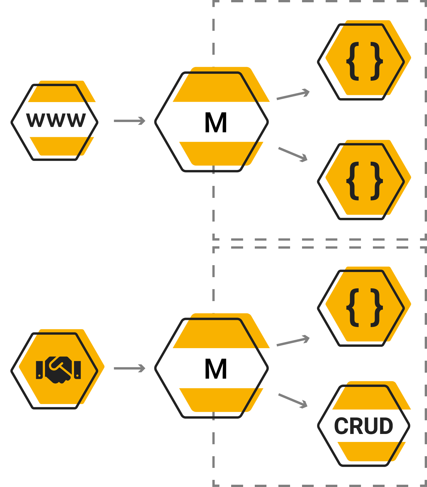

---
meta:
  - name: description
    content: Introduction
  - name: keywords
    content: semaphore getting started introduction
---

# Introduction

Semaphore is a tool to orchestrate your micro-service architecture. Requests could be manipulated passed branched to different services to be returned as a single output.
You could define request flows on top of your currently existing schema definitions.
Please check out the [examples directory](https://github.com/jexia/semaphore/tree/master/examples) for more examples.



::: tip
In many of the available examples are protobuffers used. Semaphore currently supports protobuffers more official schema definitions such as Avro and XML will be added in the future
:::

```hcl
endpoint "GetUser" "http" {
    endpoint = "/user/:id"
    method = "GET"
}

flow "GetUser" {
    input "proto.Query" {}
    
    resource "user" {
        request "proto.Users" "Get" {
            id = "{{ input:id }}"
        }
    }
    
    output "proto.User" {
        name = "{{ user:name }}"
    }
}
```
```protobuf
package proto;

service Users {
    option (maestro.service) = {
        host: "https://service.user/"
        protocol: "http"
        codec: "json"
    };

    rpc Get(Query) returns (User) {
        option (maestro.http) = {
            endpoint: "/user/:id"
            method: "GET"
        };
    };
}
```

Maestro is an open-source product developed with ❤️ by [Jexia](https://www.jexia.com)

Jexia is a developer platform that provides services to help you build web and mobile applications in a fast and simple way.